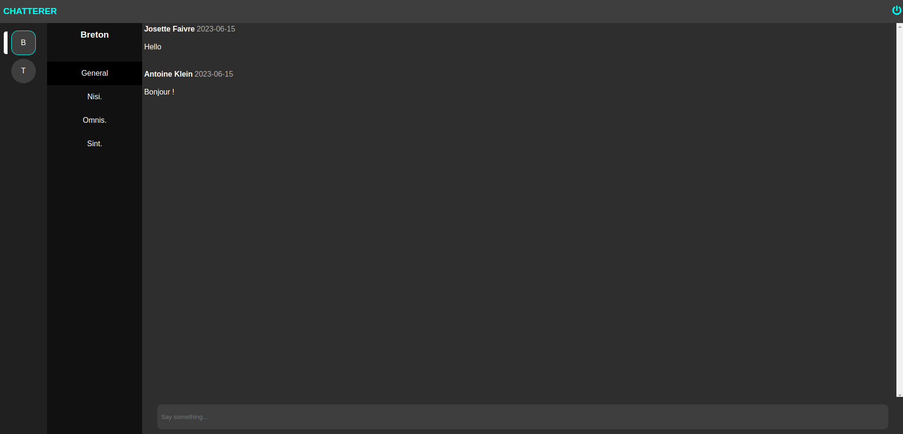

<!-- PROJECT SHIELDS -->
[![Contributors][contributors-shield]][contributors-url]
[![Forks][forks-shield]][forks-url]
[![Stargazers][stars-shield]][stars-url]
[![Issues][issues-shield]][issues-url]
[![License][license-shield]][license-url]
[![LinkedIn][linkedin-shield]][linkedin-url]

<br />

<center>

  
  

</center>

<div align="center">
  <a href="https://github.com/Zusoy/chatterer">
    
  </a>
  <br />

  <h3 align="center">Chatterer</h3>

  <p align="center">
    An open-source family scale chatting application for everyone !
    <br />
    <br />
    <a href="https://github.com/Zusoy/chatterer/issues">Report Bug</a>
    ·
    <a href="https://github.com/Zusoy/chatterer/pulls">Request Feature</a>
  </p>
</div>

<!-- TABLE OF CONTENTS -->
<details>
  <summary>Table of Contents</summary>
  <ol>
    <li>
      <a href="#about-the-project">About The Project</a>
      <ul>
        <li><a href="#built-with">Built With</a></li>
        <li><a href="#features">Features</a></li>
      </ul>
    </li>
    <li>
      <a href="#getting-started">Getting Started</a>
      <ul>
        <li><a href="#prerequisites">Prerequisites</a></li>
        <li><a href="#installation">Installation</a></li>
      </ul>
    </li>
    <li><a href="#contact">Contact</a></li>
  </ol>
</details>

<!-- ABOUT THE PROJECT -->
## About The Project

Chatterer is an open-source chatting web application. At first, this project was essentially for development practice purpose but I thought that an simple open-souce chatting application for everyone would be so cool !

So feel free to:

- Use the app with your friends
- Contribute to the application
- Give features ideas

### Built With

Chatterer is built with :

* [![Docker][Docker.com]][Docker-url]
* [![React][React]][React-url]
* [![Symfony][Symfony.com]][Symfony-url]
* [![Nginx][Nginx.com]][Nginx-url]
* [![Swagger][Swagger.io]][Swagger-url]

### Features

Chatterer is mostly inspired by Slack and Discord.
If you want to see the features documentation you can go to the [API Gherkin Documentation](https://github.com/Zusoy/chatterer/tree/master/apps/api/doc/features) which is API acceptances tests (Behat)


<br/>
<i>Preview from the v0.0.1</i>


<!-- GETTING STARTED -->
## Getting Started

This is a quick start to install the application locally

### Prerequisites

You need docker on your machine to get Chatterer working.

- `docker >=20.10.14` is required

### Installation

1. First clone the repository
```sh
git clone git@github.com:Zusoy/chatterer.git
```

2. Copy `.env` file
```sh
cp -n .env.dist .env
```

3. Build the app:
```sh
make build
```

4. And then start it:
```sh
make start
```

<!-- CONTACT -->
## Contact

Project Link: [https://github.com/Zusoy/chatterer](https://github.com/Zusoy/chatterer)

<!-- MARKDOWN LINKS & IMAGES -->
<!-- https://www.markdownguide.org/basic-syntax/#reference-style-links -->
[contributors-shield]: https://img.shields.io/github/contributors/zusoy/chatterer.svg?style=for-the-badge
[contributors-url]: https://github.com/Zusoy/chatterer/graphs/contributors
[forks-shield]: https://img.shields.io/github/forks/zusoy/chatterer.svg?style=for-the-badge
[forks-url]: https://github.com/Zusoy/chatterer/network/members
[stars-shield]: https://img.shields.io/github/stars/zusoy/chatterer.svg?style=for-the-badge
[stars-url]: https://github.com/Zusoy/chatterer/stargazers
[issues-shield]: https://img.shields.io/github/issues/zusoy/chatterer.svg?style=for-the-badge
[issues-url]: https://github.com/Zusoy/chatterer/issues
[linkedin-shield]: https://img.shields.io/badge/-LinkedIn-black.svg?style=for-the-badge&logo=linkedin&colorB=555
[linkedin-url]: https://www.linkedin.com/in/gr%C3%A9goire-drapeau-742425123/
[license-shield]: https://img.shields.io/github/license/zusoy/chatterer.svg?style=for-the-badge
[license-url]: https://github.com/zusoy/chatterer/blob/master/LICENSE.txt

[Docker.com]: https://img.shields.io/badge/DOCKER-2496ED?style=for-the-badge&logo=docker&logoColor=white
[Docker-url]: https://www.docker.com/
[React]: https://img.shields.io/badge/React-3998B6?style=for-the-badge&logo=react&logoColor=white
[React-url]: https://react.dev/
[Symfony.com]: https://img.shields.io/badge/Symfony-000000?style=for-the-badge&logo=symfony&logoColor=white
[Symfony-url]: https://symfony.com/
[Nginx.com]: https://img.shields.io/badge/NGINX-009639?style=for-the-badge&logo=nginx&logoColor=white
[Nginx-url]: https://nginx.com
[Swagger.io]: https://img.shields.io/badge/SWAGGER-85EA2D?style=for-the-badge&logo=swagger&logoColor=white
[Swagger-url]: https://swagger.io/
